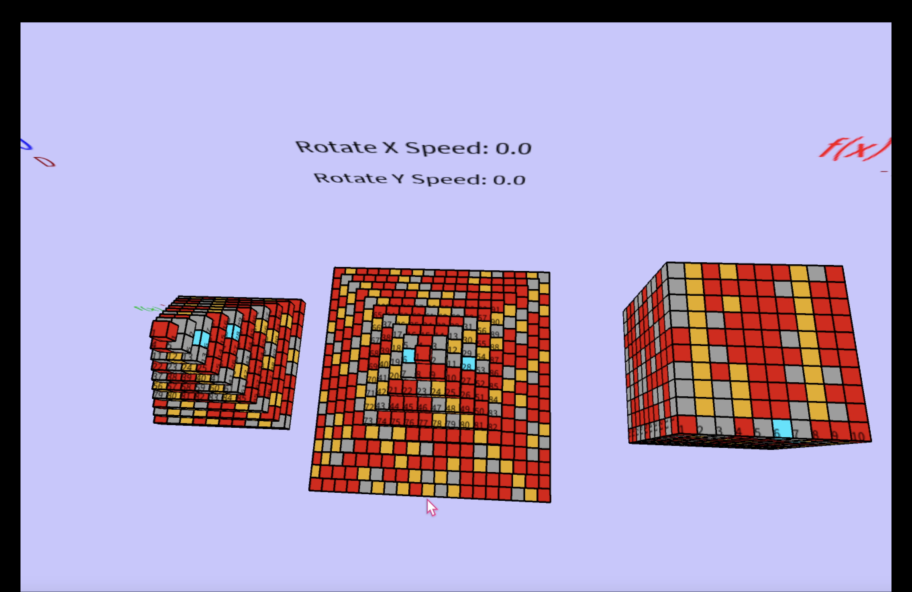
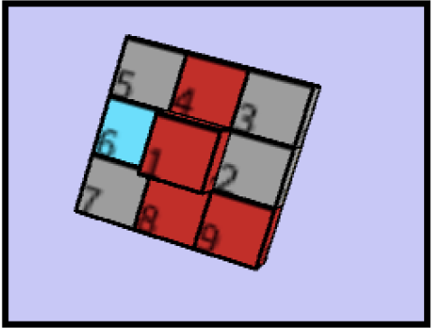
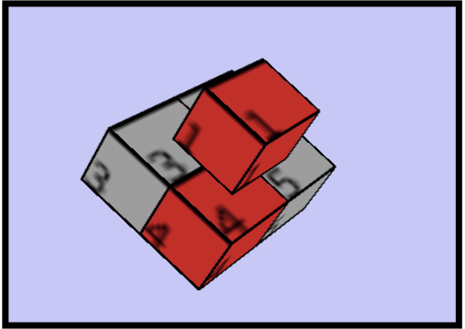

# 3D_Ulam_Spiral

**3D Ulam Spiral is an academic project in Processing at the University of Paris-Saclay.**

## Subject
We have created pyramids and a cube with the Ulam spiral composed of cubes containing a number on a colour according to its characterisation (prime, perfect, abundant, deficient). Also, the increment of each shape can be controlled by the user as a polynomial. Finally, the shapes have rotations whose speeds can be controlled by the user.

The difference between the two pyramids lies in the formation of each floor, with the first floor having a base of 1-8 (see a ) and the second floor having a base of 1-4 (see b ).

---------------------------**(a)**------------------------------------------------------------------**(b)**----------------------------------------

## Tools
- Control the speed and axis of rotation (arrows keys)
- Manually control the vue with the mouse (click and drag)
- Change the coefficients of the second degree polynomials (keys letters)

To use this program, run the file [PROJET.pde] with all the .pde and .glsl files in a sketch of Processing.

